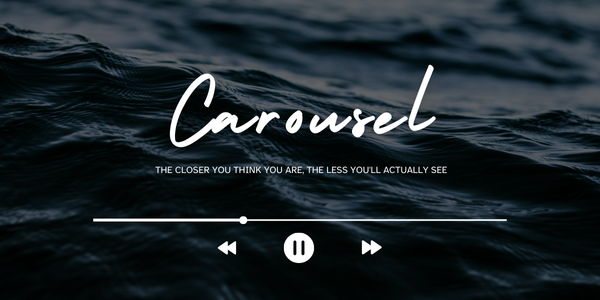

Carousel is a real-time audio visualiser built with **OpenGL** and **C++**. The audio's frequency spectrum is captured using **Fast Fourier Transform (FFT)** and visualised using a rotating audio ring where the bars on the outer surface pulse with the sound.

## Table of Contents

- [Features](#features)
- [Installation](#installation)
    - [Dependencies](#dependencies)
    - [Building the Project](#building-the-project)
- [Screenshots](#screenshots)

## Features

- 🎧 **Real-Time Frequency Analysis**  
  Captures live audio data and visualizes frequency magnitudes as animated bars on a revolving ring.

- 🎮 **OpenGL Rendering**  
  Renders a dynamic, rotating ring using OpenGL with custom shaders for a smooth, high-performance visual experience.

- 🔊 **OpenAL Audio Playback**  
  Streams and plays audio using OpenAL while simultaneously feeding it to the visualizer.

- ⚡ **Fast Fourier Transform (FFT)**  
  Uses KissFFT (a lightweight FFT library) to convert time-domain audio into frequency-domain data in real time.

- 💻 **Modern C++17 Codebase**  
  Developed using C++17 for clean syntax, performance, and maintainability.

- 🛠️ **CMake Build System**  
  Easy setup and cross-platform compatibility with a clean `CMakeLists.txt` configuration.


## Installation

### Dependencies
The project includes the required libraries in the `externals/` directory, so you do not need to manually download them. This makes the setup process simpler for users. The external libraries bundled are:

- **GLFW**: A library for creating windows with OpenGL contexts and handling user input.
- **GLAD**: An OpenGL loader to manage extensions.
- **KissFFT**: A lightweight FFT library used for real-time frequency analysis.
- **STB**: A header-only library for decoding Ogg Vorbis files into raw audio data.

If you'd like to modify or update these dependencies, you can replace the respective folders in the `externals/` directory.

In addition to the bundled libraries, the project requires the following system packages to function properly:
- **OpenGL** : Graphics rendering library
- **OpenAL** : Used for audio playback

On Ubuntu-based systems (or other Linux distributions using `apt`), you can install the required dependencies with the following command:

```bash
sudo apt-get install libglfw3-dev libopenal-dev libglm-dev
```

### Building the Project

1. Clone the repository:

    ```bash
    git clone https://github.com/16aurora/Carousel.git
    cd Carousel
    ```

2. Create a build directory and navigate into it:

    ```bash
    mkdir build
    cd build
    ```    

3. Run CMake to configure the project:

    ```bash
    cmake ..
    ```

4. Build the executable:

    ```bash
    cmake --build . --parallel
    ```    

5. Run the project:

    ```bash
    ./carousel
    ```    


## Screenshots


