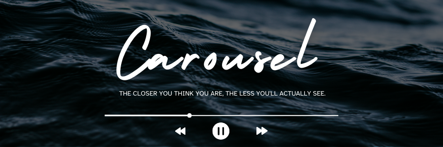

Carousel is a real-time audio visualiser built with **OpenGL** and **C++**. The audio's frequency spectrum is captured using **Fast Fourier Transform (FFT)** and visualised using a rotating audio ring where the bars on the outer surface pulse with the sound.

## Table of Contents
- [Features](#features)
- [Installation](#installation)
    -[Dependencies](#dependencies)
    -[Building the project](#build)
- [Screenshots](#screenshots)
- [License](#license)

## Features

- 🎧 **Real-Time Frequency Analysis**  
  Captures live audio data and visualizes frequency magnitudes as animated bars on a revolving ring.

- 🎮 **OpenGL Rendering**  
  Renders a dynamic, rotating ring using OpenGL with custom shaders for a smooth, high-performance visual experience.

- 🔊 **OpenAL Audio Playback**  
  Streams and plays audio using OpenAL while simultaneously feeding it to the visualizer.

- ⚡ **Fast Fourier Transform (FFT)**  
  Uses KissFFT (a lightweight FFT library) to convert time-domain audio into frequency-domain data in real time.

- 💻 **Modern C++17 Codebase**  
  Developed using C++17 for clean syntax, performance, and maintainability.

- 🧩 **Modular Architecture**  
  Organized into distinct components: `audio`, `renderer`, and `shaders` for easy understanding and extensibility.

- 🛠️ **CMake Build System**  
  Easy setup and cross-platform compatibility with a clean `CMakeLists.txt` configuration.

- 🔧 **GLFW for Window Management**  
  Manages OpenGL context creation and input handling using the lightweight GLFW library.

- 🧱 **GLAD for OpenGL Function Loading**  
  Handles OpenGL function pointers, allowing you to use modern OpenGL functions without boilerplate.

